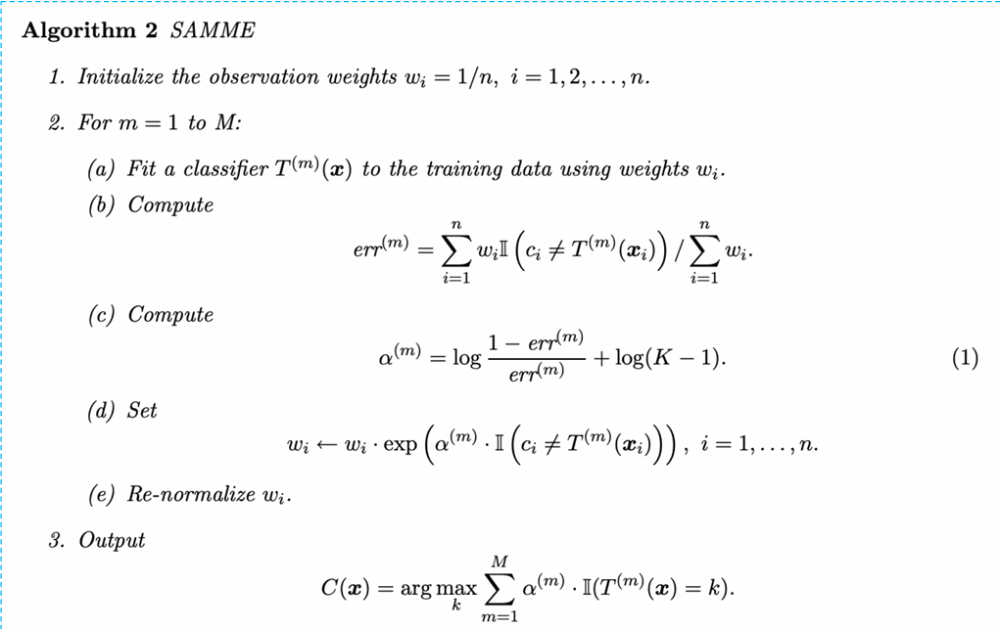

# [PYTHON] AdaBoost, GradientBoost, xGBoost without libary

## Introduction

This project is use to tackle the problem of classification with the datasets of csgo, where with some features, we will predict the game will lose or win or tie

## Setup
You can download the dataset in this repository or you can go to kaggle to download the dataset 

## Datasets
https://www.kaggle.com/code/jonathanbouchet/csgo-ping-s-data

## Knowledge

* What xGBoost is more upgraded than DecisionTree or RandomForest? When RandomForest is used bagging, xGBoost is boosting, it means in xGBoost we don't build the tree parallel, we built sequential, and have the weights to know impact of each trees we build to fair 
## Explain algorithm
 
<a href='https://www.researchgate.net/publication/228947999_Multi-class_AdaBoost'> You can read this newspaper article to know more</a>

## Requirements
* **Python**
* **AdaBoost, GradientBoost, xGBoost**